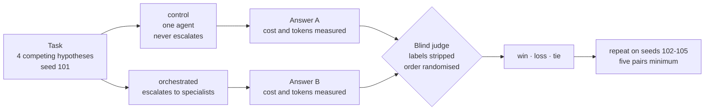
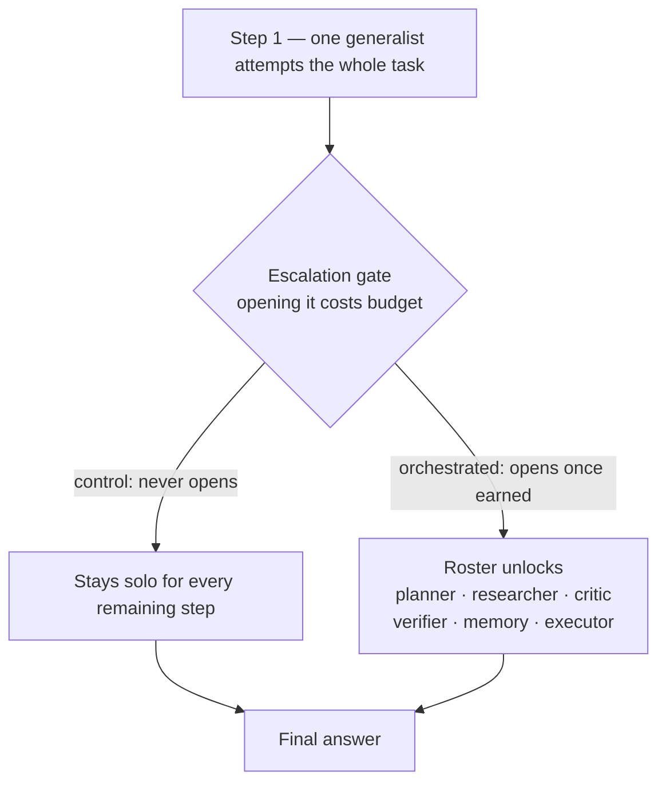
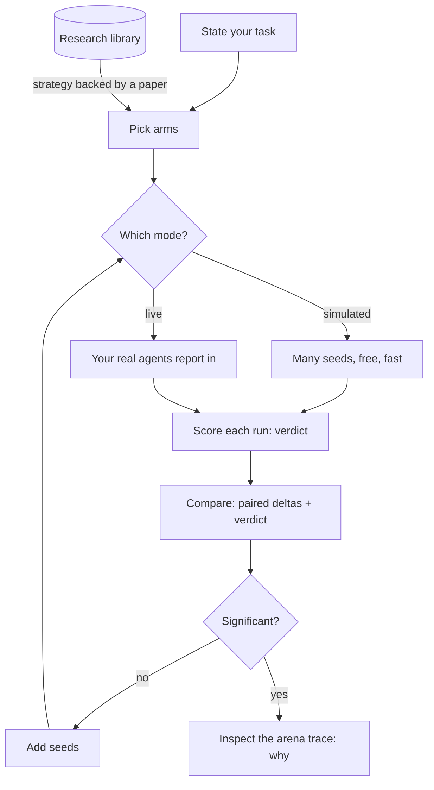
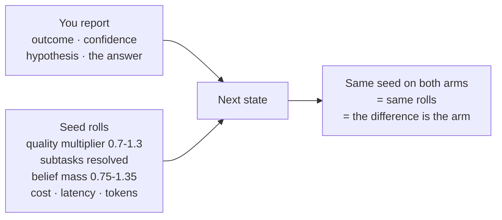

## What this is

Most multi-agent frameworks assume the answer. They hard-code a workflow — planner, then researcher, then critic — and never ask whether any of it beat one agent doing the work alone.

This asks. One generalist starts the task; if it stalls, a policy decides whether to **escalate** into orchestration. Every arm is measured against a single-agent control on the same seeds. Then it renders the whole thing as a playable pixel-art game, so you can watch orchestration being bought.



The fork is the only difference between the arms, and the judge never learns which is which.

## The question it answers

> Is your multi-agent setup actually better than one agent — and by how much, at what cost?

Run a control arm and one or more strategy arms on the same task and seeds. The comparison pairs on seeds, reports differences with standard errors, and **refuses to rank arms on internal reward**: that metric pays for belief collapse, which a single-agent control never attempts, so ranking on it would let orchestration win by construction.

Cost, latency and tokens are measured. Quality is not — it comes from a `verdict` you record, because nothing inside the reward function can tell you whether the answer got better.

## Why this exists

Three properties drive every design choice:

* The successor state is **sampled, never computed**. Replaying the same action from the same state lands somewhere else. In live mode the outcome is not sampled at all — it is whatever a real agent actually produced.
* Uncertainty is a **probability distribution**, so information gain is measured in bits rather than asserted.
* Every number on screen comes from a **persisted trace**, so any claim in the UI can be traced to the step that produced it.

## The escalation gate

A run starts solo. `ESCALATE` is the only other legal action until it fires, after which the specialists unlock. That makes "should I orchestrate at all" the first decision under uncertainty rather than an assumption.



Whether that gate should open is an empirical question rather than a design decision, so the repository ships the tool that answers it instead of an answer that goes stale. [backend/tools/balance.py](backend/tools/balance.py) runs every policy over identical seeds and reports reward, win rate, step count and how each episode ended.

```powershell
python -m tools.balance --episodes 40
```

Read the termination column first. A policy that terminates voluntarily in most episodes is not routing badly — it is declining to route at all, which is a different failure with a different cause. Include `random` in any comparison you draw from it: a learned policy that cannot beat uniform selection has not learned anything worth carrying.

## The policy stack

| Stage | Policy | Mechanism | The limitation it exposes |
| --- | --- | --- | --- |
| 0 | `random`, `heuristic` | Uniform / hand-tuned scoring | No learning at all |
| 1 | `contextual_bandit` | Disjoint LinUCB over a 15-dimensional state context | Optimizes immediate reward; no credit across time |
| 2 | `mdp` | Tabular Q-learning plus a linear approximator, Boltzmann exploration | Agents are flat action labels |
| 3 | `markov_game` | Per-player values plus a learned pairwise synergy matrix | Cooperative case only |
| 4 | `marl` | VDN additive mixing, abstention baselines, difference rewards | Linear function approximation |

Stage 3 is where the framing changes: agents stop being action labels and become players. Coalition value is the sum of member values plus learned synergy, so the policy chooses **how many agents to fan out to**, rather than being told.

## Strategies: the arm catalog

A **strategy** is a policy plus the configuration that makes it a coherent approach, linked to the part of the research taxonomy that motivates it. Picking an arm means picking a published idea to test against your own baseline, so the library stops being a reference shelf and becomes the menu.

| Strategy | Escalates | What it is |
| --- | --- | --- |
| `control` | never | One generalist, no routing. Always include it |
| `cascade` | on stall | Solo until progress stalls, then escalate |
| `always_orchestrate` | immediately | Hardcoded specialist rotation |
| `learned_bandit` | learned | LinUCB over the state context |
| `learned_mdp` | learned | Q-learning with a linear approximator |
| `learned_markov_game` | learned | Per-player values plus learned synergy |
| `learned_marl` | learned | VDN mixing with difference rewards |

`GET /api/meta` returns the catalog; `POST /api/runs` accepts a `strategy` id and derives the policy, its options and the arm name.

`GET /api/meta/strategies/{id}/papers` returns the papers a strategy implements, drawn from the live library and reordered by overlap with its paper query. The control returns nothing and says why — it was picking up an orchestration paper purely because it shares the routing tag, and citing that beside a single-agent baseline would be wrong.

## User workflow



Explore in simulation, confirm live. A live step costs real time and credits, so a three-arm five-seed experiment is only affordable in simulation; use live runs to confirm a shape you already found.

## What you get

* **Compare** — the destination: arms side by side, paired on seeds, with standard errors and an explicit verdict sentence that refuses to overclaim.
* **Arena** — one agent until the policy escalates, then specialists appear on the ring. Entropy rendered as fog that clears as the belief sharpens, damage-number reward popups, HP-style meters.
* **Graph** — React Flow interaction graph where edge width is message volume and labels carry the mean probability weight.
* **Rewards** — cumulative and per-step reward, entropy against information gain, the full reward decomposition, per-agent contribution with cost efficiency.
* **Traces** — every step, expandable into the policy's action distribution, the reward breakdown, the state transition and the real agent output in live mode.
* **Research Library** — 43 curated papers, 81 citation edges, a nine-category taxonomy, and live search across arXiv, Semantic Scholar, Papers With Code and an MCP tool provider.

## Quick start

The Python environment must live **outside** any cloud-synced folder. A venv inside OneDrive or Dropbox syncs tens of thousands of files and trips data-loss scanners on pip's vendored CA bundle.

```powershell
py -3 -m venv C:\venvs\markov-agent-orchestrator
C:\venvs\markov-agent-orchestrator\Scripts\Activate.ps1
cd backend
pip install -r requirements.txt
python -m uvicorn app.main:app --reload --port 8000
```

```powershell
cd frontend
npm install
npm run dev
```

Open <http://localhost:3000> and press start. Or run both with `.\scripts\dev.ps1`.

> [!TIP]
> Do not run `npm run build` while `npm run dev` is live. They share `.next`, and the production build wipes the dev server's chunks.

## Two modes: simulated and live

**Sim mode** is the default. The six agents are stochastic processes, not language model calls — each is a parameter set covering cost, latency, token draw, a Beta competence prior, evidence strength and noise, and the transition kernel samples from those distributions.

No model SDK is used and no API key is required, so an episode costs nothing and is reproducible from its seed. **Token and dollar figures are sampled quantities, not billed ones.**

That is deliberate. Policy learning needs thousands of episodes, and paying for inference on each would make the research loop unaffordable and non-reproducible.

**Live mode** removes the simulation. The policy still decides *who acts*; a real agent decides *what that agent produces*. A step is split in two so a model can sit in the middle:

| Call | Effect |
| --- | --- |
| `POST /api/runs/{id}/live/open` | The policy picks the action and agents, and returns their briefs. **Does not advance the run.** |
| `POST /api/runs/{id}/live/report` | Real output is folded in and the episode advances one step |

Cost, latency and token counts stop being drawn and start being measured. Reports flow through the same transition kernel, reward decomposition and persistence as sim mode, so nothing downstream changes.

There is no play button in live mode, and that is not a limitation. Pacing is the conversation, so every call is one you asked for.

> [!IMPORTANT]
> **Nothing is fabricated on your behalf.** A live report must carry a non-empty `response` and measured `tokens`, `latency_ms` and `cost_usd`; omitting them is refused rather than filled in from the agent spec. Resubmitting work the run already recorded is refused too. If you cannot measure a call, you are not running live — use sim mode, which is honest about being sampled.

> [!IMPORTANT]
> Live mode has no ground truth. Sim mode grades evidence against a hidden `latent_hypothesis`; a real task has no such label. Live reports carry a `claimed_hypothesis` instead, so belief mass follows what each agent argued for and **confidence only rises when independent agents agree**. An agent that confidently asserts nonsense will move the belief until the Verifier disputes it.

The only other outbound calls belong to the research providers, and all of them fall back to a local corpus when offline.

## Running an experiment

An experiment is a set of runs sharing an `experiment` name, split into `arm`s, on the **same seeds**. One arm must be called `control`.

```powershell
# same seed, one arm per strategy
foreach ($seed in 101..105) {
  foreach ($arm in 'control','cascade','always_orchestrate') {
    $body = @{ task='<your task>'; strategy=$arm; arm=$arm; seed=$seed
               experiment='worth-it'; max_steps=12 } | ConvertTo-Json
    $run = Invoke-RestMethod http://localhost:8000/api/runs -Method Post `
             -Body $body -ContentType 'application/json'
    Invoke-RestMethod "http://localhost:8000/api/runs/$($run.id)/step" -Method Post `
      -Body (@{steps=12}|ConvertTo-Json) -ContentType 'application/json' | Out-Null

    # quality cannot be measured, only judged
    Invoke-RestMethod "http://localhost:8000/api/runs/$($run.id)/verdict" -Method Post `
      -Body (@{score=0.7; rubric='correctness + specificity'}|ConvertTo-Json) `
      -ContentType 'application/json' | Out-Null
  }
}
```

Then open `/compare`, or `GET /api/experiments/worth-it`. The response carries per-arm means, paired deltas against the control with standard errors, a one-line `verdict`, and `caveats` that call out thin evidence, unjudged arms and a missing control.

What it will not do is rank arms on internal reward. If you want a number that says orchestration won, you have to supply a verdict.

### Why the same seed on every arm

The seed does not control your work. It controls the world's reaction to it.



Even in live mode, where you supply every outcome, the engine decides what that outcome is worth: how far a success moves quality, how many subtasks it resolves, how much belief mass its evidence carries. All of that is drawn from the seed.

Run the arms on different seeds and one may face a generous instance while the other faces a stingy one. You would have measured the dice. The seed is also the literal join key — `_paired_delta` matches runs by `r.seed`, so unpaired arms report `paired_seeds: 0` and no comparison is computed at all.

One honest limit: because arms take different actions, they consume the generator at different rates and diverge in offset after the first branch. The seed fixes the starting instance and the distribution, not every individual draw.

### Blind pairwise judging

Absolute scores compress. A judge rating one answer at a time drifts toward the top of its range, so two arms can land within a point or two of each other regardless of how they differ — noise between two scorings rather than a measurement.

So the quality question is settled by forced choice instead, the protocol MT-Bench and Chatbot Arena use: both final answers side by side, **labels stripped and order randomised**, pick one.

```powershell
$pw = @{ run_a=$controlId; run_b=$armId; winner='<a|b|tie>'
         judge='copilot'; rubric='<the rubric, written before the runs>'
         notes='<what decided it>' } | ConvertTo-Json
Invoke-RestMethod "http://localhost:8000/api/experiments/worth-it/pairwise" `
  -Method Post -Body $pw -ContentType 'application/json'
```

Win rates clear the same two-standard-error bar used everywhere else, which against a fair coin is `1/sqrt(n)`. That has a consequence worth knowing before spending anything:

| Decisive comparisons | Win rate needed |
| --- | --- |
| 3 | above 1.08 — impossible |
| 4 | above 1.00 — impossible |
| 5 | above 0.947 — a clean sweep |
| 9 | above 0.833 |

**Below five paired seeds, significance is unreachable by construction.** Ties are recorded and counted, never dropped: two arms being indistinguishable is a real finding, and forcing a preference manufactures one that is not there.

### Simulated and live results are never pooled

Sampled outcomes and real agent work look identical downstream, so the comparison tracks mode per arm and refuses to mix them. A wholly simulated experiment is labelled as a check of the mechanism rather than evidence about agents; an experiment containing both modes is rejected outright, because pairing a sampled outcome against a real one on a shared seed compares nothing.

## Driving a live run from your agent

The backend does not call a model — it is called *by* one. Anything that can make HTTP requests can drive it; [.github/copilot-instructions.md](.github/copilot-instructions.md) carries the protocol, which the GitHub Copilot CLI reads automatically.

```powershell
.\scripts\dev.ps1        # backend + frontend
cd c:\src\markov-agent-orchestrator
copilot                  # then: "run the arena on <your task>"
```

The agent creates the run, calls `live/open`, does the work the brief describes, and reports back. Open the printed `http://localhost:3000/?run=<id>` to watch it arrive — REST-driven steps are broadcast to spectators over the WebSocket, so the arena updates without driving anything itself.

Live steps cost real time and real credits, which is the point: the numbers on screen are billed, not sampled.

## Research Intelligence Layer

| Provider | Contribution |
| --- | --- |
| arXiv | Preprint coverage via the public Atom API |
| Semantic Scholar | Real citation counts and reference edges |
| Papers With Code | Which papers have reproducible implementations |
| `HITSMCPResearchProvider` | External MCP tool server over JSON-RPC |
| Curated corpus | Offline foundation, always available |

Providers **degrade rather than fail**: on a network error the response is served from the curated corpus and flagged `degraded`, which the UI surfaces instead of passing stale data off as live.

The MCP provider stays useful with no endpoint configured — it ranks the local corpus using Kleinberg HITS over the citation graph, separating authorities from hubs.

## Layout

```text
backend/
  app/orchestration/   State, actions, escalation, transitions, rewards, policies, strategies
  app/research/        Provider abstraction + arXiv / Semantic Scholar / PwC / HITS MCP
  app/api/             REST + WebSocket routers
  app/services/        Run lifecycle, experiments, spectator hub
  tools/               balance.py (single-episode policy probe)
  tests/               118 tests
frontend/
  app/                 Title screen, arena, compare, research library
  components/game/     Arena, HUD, Controls, GraphView, RewardDashboard, TraceExplorer
  components/pixel/    Sprite renderer with animation playback
docs/                  Architecture, ResearchRoadmap, DesignDecisionLog
research/              Curated offline corpus
scripts/               dev.ps1, fetch-sprites.ps1
```

## Testing and measurement

```powershell
cd backend
python -m pytest -q                                  # 118 tests
python -m tools.balance --episodes 40                # policy behaviour across seeds
```

The balance harness exists because playing the game revealed what the tests could not: the win condition was originally unreachable by construction, in every episode, and nothing went red. That story is recorded in [docs/DesignDecisionLog.md](docs/DesignDecisionLog.md).

### What the tests do not cover

Every test here checks *mechanics* — that snapshots round-trip, that a stale profile is refused, that the comparison refuses to rank on reward. **None of them assert that a learned policy beats the hardcoded pipeline.** The central claim is therefore untested: routing could regress arbitrarily far without a single test failing. If you want that claim defended, it has to become a test.

## API surface

| Route | Purpose |
| --- | --- |
| `GET /api/meta` | Agents, actions, policies, **strategies**, taxonomy, reward weights |
| `POST /api/runs` | Create a run; accepts `strategy`, `experiment`, `arm`, `task_shape` |
| `POST /api/runs/{id}/step` | Advance a simulated run |
| `POST /api/runs/{id}/live/open` | Ask the policy who acts next; does not advance |
| `POST /api/runs/{id}/live/report` | Fold in real agent output and advance |
| `POST /api/runs/{id}/verdict` | Record judged answer quality |
| `POST /api/experiments/{name}/pairwise` | Record a blind head-to-head preference |
| `GET /api/meta/strategies/{id}/papers` | The published work a strategy implements |
| `GET /api/experiments` | List experiments and their arms |
| `GET /api/experiments/{name}` | Paired comparison, verdict and caveats |

| `WS /ws/runs/{id}` | Live step stream for spectators |

## Art

Sprites were generated with [PixelLab](https://www.pixellab.ai) via its MCP server and are re-fetchable with `.\scripts\fetch-sprites.ps1`, which pulls each character archive and regenerates the manifest. The renderer falls back to hand-authored procedural SVG sprites when no generated art is present, so the app never depends on the asset pipeline having run.

Eight characters: the **generalist** who works solo before escalation, six specialists who appear only once orchestration is bought, and the orchestrator that replaces the generalist at the centre when it does. That transition is the clearest picture of what this repository measures — you can see the moment the extra agents get paid for.

The roster is styled after a corporate-hacker-noir aesthetic using original archetypes rather than any protected character designs.

## Documentation

* [docs/Architecture.md](docs/Architecture.md) — decision formalism, transition kernel, reward decomposition, persistence
* [docs/ResearchRoadmap.md](docs/ResearchRoadmap.md) — the staged path and what each stage removes
* [docs/DesignDecisionLog.md](docs/DesignDecisionLog.md) — 13 decisions with rejected alternatives and accepted costs
