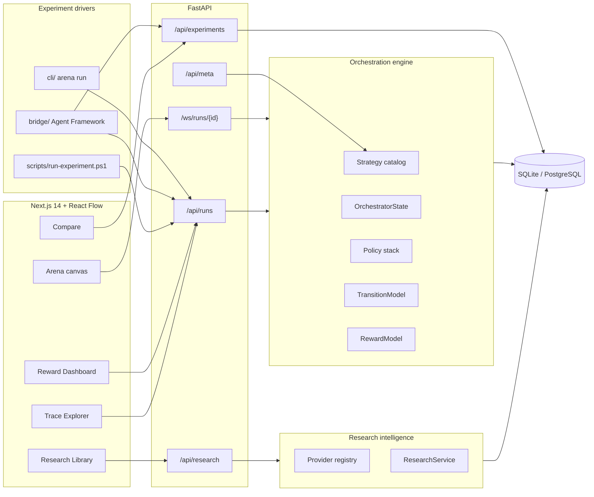
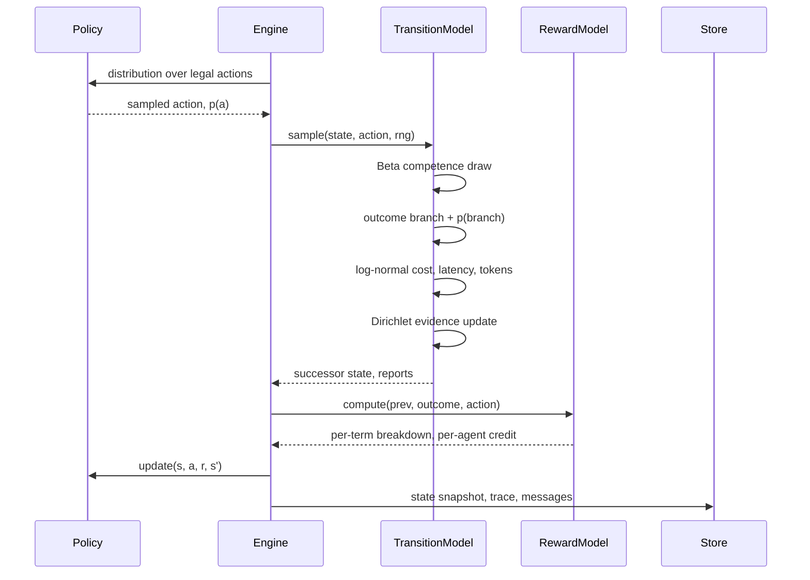

## Overview

The platform treats agent selection as a sequential decision problem under uncertainty rather than a fixed workflow. A run is an episode: the orchestrator observes a state, samples an action from a policy, observes a stochastic transition, receives a decomposed reward, and repeats until a termination condition fires.

Three properties drive every design choice:

* The successor state is sampled, never computed. Replaying the same action from the same state produces a different outcome.
* Uncertainty is represented explicitly as a probability distribution, so information gain is a measured quantity rather than a metaphor.
* Every number displayed in the interface comes from a persisted trace record, so any claim on screen can be traced back to the step that produced it.

## System topology

The frontend holds no simulation logic. It renders persisted state and streams steps over a WebSocket, which means a page refresh never loses an episode.

The drivers hold no task logic either. They create runs, relay briefs to whatever does the work, and record what came back. A driver that reasons about the task would be an unmeasured third arm.

## The decision formalism

### State S

`OrchestratorState` in [backend/app/orchestration/state.py](../backend/app/orchestration/state.py) carries the full observation. The policy consumes a 17-dimensional feature vector derived from it:

| Feature | Source | Meaning |
| --- | --- | --- |
| `bias` | constant | Intercept term for the linear models |
| `task_complexity` | run config | Difficulty prior sampled at episode start |
| `uncertainty` | derived | Normalized Shannon entropy of the belief |
| `budget_remaining` | derived | Fraction of the dollar budget still available |
| `latency_remaining` | derived | Fraction of the latency budget still available |
| `confidence` | derived | Posterior mass on the leading hypothesis, shrunk by evidence volume |
| `memory_coverage` | accumulated | How much relevant prior context has been retrieved |
| `unresolved_ratio` | accumulated | Open subtasks over total subtasks |
| `quality` | accumulated | Artifact quality score |
| `verification_score` | accumulated | Independently verified fraction of the artifact |
| `mean_agent_success` | Beta posteriors | Average competence across the agent roster |
| `duplicate_pressure` | accumulated | Recent repeated work with no information gain |
| `has_escalated` | escalation gate | Whether specialists have been unlocked |
| `stall` | accumulated | Saturating measure of steps that moved nothing |
| `needs_evidence` | run config | How much the task depends on external evidence |
| `needs_execution` | run config | How much is producing artifacts rather than deciding |
| `needs_verification` | run config | How costly being wrong would be |

The last five exist because without them every task presented an identical context vector at step 0 — uniform belief, full budget, zero quality — leaving the policy nothing to condition its first decision on.

Task-shape and `stall` are excluded from `discretize()`, which keys the tabular value functions. That table holds tens of entries after several episodes, and extra dimensions would multiply its key space for no gain; specialization reaches the linear policies through `features()` instead.

Uncertainty is not a free parameter. The orchestrator maintains a Dirichlet concentration vector over `K` competing solution hypotheses (default 8). Entropy is computed on the posterior mean of that Dirichlet, in bits.

Confidence deserves a note. A posterior can be sharply peaked while resting on almost no evidence, and reporting that as high confidence would be misleading. `confidence_from_belief` shrinks the leading mass toward the uniform prior in proportion to total observed concentration, so confidence rises only when the peak is backed by observations.

### Action space A

Ten actions, defined in [backend/app/orchestration/actions.py](../backend/app/orchestration/actions.py):

* `INVOKE_GENERALIST`, the solo agent that works before any orchestration is bought
* `ESCALATE`, which unlocks the specialists and is the episode's first real decision
* Six single-agent invocations covering Planner, Research, Critic, Verification, Memory, and Executor
* `RUN_PARALLEL`, which dispatches a coalition of two or three agents
* `TERMINATE`, which stops the episode and triggers the terminal reward

The action space is **gated on escalation**. Before it fires, only `INVOKE_GENERALIST` and `ESCALATE` are legal, so a run cannot orchestrate without first deciding to. `min_solo_steps` requires a solo attempt before `ESCALATE` becomes available, because escalating before trying is not a decision informed by anything.

After escalation the specialists unlock. `RUN_PARALLEL` still requires budget and latency headroom, and `TERMINATE` is still gated behind `min_steps_before_terminate`, because an orchestrator that stops before producing anything is not making a meaningful decision.

### Transition kernel P

[backend/app/orchestration/transitions.py](../backend/app/orchestration/transitions.py) samples the successor state. For each invoked agent:

1. Draw a competence sample from that agent's Beta posterior, discounted by task complexity and residual uncertainty.
2. Draw a uniform variate to realize one of success, partial, or failure, and record the probability of the branch that was actually taken.
3. Draw cost, latency, and token consumption from log-normal distributions centered on the agent's baseline.
4. Fold sampled Dirichlet evidence into the belief. Correct evidence concentrates on the latent hypothesis; incorrect evidence concentrates on a competing one.

Every agent also contributes diffuse Dirichlet noise. The Critic contributes the most, which is deliberate: surfacing an unconsidered failure mode legitimately reopens hypotheses and raises entropy. Information gain is allowed to be negative, and the interface shows that honestly.

The Beta posterior updates after each invocation, so an agent that keeps failing becomes progressively less attractive to every learning policy without any hand-written rule saying so.

### Reward R

[backend/app/orchestration/rewards.py](../backend/app/orchestration/rewards.py) returns each term separately rather than a scalar:

$$
R = w_q \Delta q + w_v \Delta v + w_i \big( H_t - H_{t+1} \big) + w_p \rho - w_c \hat{c} - w_l \hat{\ell} - w_d \delta + B_T
$$

The terms are quality delta, verification delta, information gain in bits, subtask progress, normalized cost, normalized latency, duplicate work, and a terminal bonus. Weights live in `RewardWeights` and are overridable by environment variable.

Keeping the decomposition intact serves three consumers. The reward dashboard renders it directly. The Markov game and MARL policies use per-agent credit shares for their difference-reward signal. Anyone tuning the system can see which term dominates instead of guessing.

The terminal bonus rewards finishing well and penalizes bailing out. Choosing `TERMINATE` with most subtasks still open subtracts value, and running out of budget or latency carries its own penalty.

## Policy stack

All five policies implement the same interface in [backend/app/orchestration/policies/base.py](../backend/app/orchestration/policies/base.py): map a state to a distribution over legal actions, then sample. Sampling rather than taking the argmax keeps exploration visible in the interface and makes the recorded `action_probability` the genuine probability of the branch that was taken.

| Stage | Policy | Mechanism | Limitation it exposes |
| --- | --- | --- | --- |
| 0 | `random` | Uniform over legal actions | Control condition |
| 0 | `heuristic` | Hand-tuned scoring over state features | No learning at all |
| 1 | `contextual_bandit` | Disjoint LinUCB, one ridge model per action | Optimizes immediate reward; no credit across time |
| 2 | `mdp` | Tabular Q-learning blended with a linear approximator | Treats the agent roster as a flat action set |
| 3 | `markov_game` | Per-player values plus learned pairwise synergy over coalitions | Cooperative case only |
| 4 | `marl` | VDN additive mixing, abstention baselines, difference rewards | Linear function approximation |

Stage 3 is where the framing changes. Agents stop being action labels and become players. Coalition value is the sum of member values plus learned pairwise synergy, minus a coordination cost that scales with budget pressure, so the policy chooses coalition size itself instead of being told when to fan out.

Stage 4 adds a learned abstention baseline per agent, which makes *not* invoking an agent an explicit decision with its own value rather than a silent omission.

## Strategy catalog

A policy is a mechanism. A **strategy** is a policy plus the configuration that makes it a coherent approach, plus the part of the research taxonomy that motivates it. [backend/app/orchestration/strategies.py](../backend/app/orchestration/strategies.py) holds the catalog, and `POST /api/runs` accepts a `strategy` id and derives the policy, its options and the arm name from it.

| Strategy | Policy | Escalates | Role in an experiment |
| --- | --- | --- | --- |
| `control` | `single_agent` | never | The baseline every comparison needs |
| `cascade` | `heuristic` | on stall | Cheap attempt first, escalate on evidence |
| `always_orchestrate` | `fixed_sequence` | immediately | Upper bookend on orchestration cost |
| `learned_bandit` | `contextual_bandit` | learned | Immediate-reward routing |
| `learned_mdp` | `mdp` | learned | Routing where actions have consequences |
| `learned_markov_game` | `markov_game` | learned | Coalition choice as an output |
| `learned_marl` | `marl` | learned | Per-agent credit assignment |

Strategies reference a taxonomy category and a search query rather than hardcoded citations, so `GET /api/meta/strategies/{id}/papers` draws from the live library and stays correct as it grows. The control returns nothing and says why: it was surfacing an orchestration paper purely through a shared routing tag, and citing that beside a single-agent baseline would misrepresent both.

The `external_driver` field records when the arena did not choose the agents. An arm driven by an outside orchestrator is still measurable, but a reader comparing arms needs to see which ones the arena decided and which ones it only recorded.

## Experiments and comparison

An experiment is a set of runs sharing an `experiment` name, split into arms, on the same seeds. [backend/app/services/experiment_service.py](../backend/app/services/experiment_service.py) computes the comparison, and its refusals matter more than its arithmetic.

* Arms are paired on `seed`, which is the literal join key. Unpaired arms report `paired_seeds: 0` and no comparison is computed.
* Arms are never ranked on internal reward. That metric pays for belief collapse, which a single-agent control never attempts, so ranking on it would let orchestration win by construction.
* Quality arrives from a recorded `verdict` or a blind pairwise preference, because nothing inside the reward function can tell you whether the answer got better.
* Simulated and live arms are never pooled. An experiment mixing both modes is rejected, since pairing a sampled outcome against a real one on a shared seed compares nothing.
* Below five decisive comparisons, a win rate cannot clear two standard errors against a fair coin. The comparison says so rather than reporting a result it cannot support.

Ties are recorded and counted rather than dropped. Two arms being indistinguishable is a finding; forcing a preference manufactures one that is not there.

## Live mode

Sim mode samples every outcome from the transition kernel. Live mode removes the sampling: the policy still decides *who acts*, and a real agent decides *what that agent produces*. A step splits in two so a model can sit in the middle.

| Call | Effect |
| --- | --- |
| `POST /api/runs/{id}/live/open` | The policy picks the action and agents and returns their briefs. Does not advance the run |
| `POST /api/runs/{id}/live/report` | Real output is folded in and the episode advances one step |
| `POST /api/runs/{id}/live/abandon` | Releases an opened step that was never reported |

Reports flow through the same transition kernel, reward decomposition and persistence as sim mode, so nothing downstream changes. Cost, latency and token counts stop being drawn and start being measured.

Two guards exist because a driver can fabricate. A report must carry a non-empty `response` and measured `tokens`, `latency_ms` and `cost_usd`; omitting them is refused rather than filled in from the agent spec. Resubmitting work the run already recorded is refused too.

Live mode also has no ground truth. Sim mode grades evidence against a hidden `latent_hypothesis`, and a real task carries no such label. Live reports supply a `claimed_hypothesis` instead, so belief mass follows what each agent argued for and confidence rises only when independent agents agree.

## Persistence

The ORM in [backend/app/models.py](../backend/app/models.py) uses only column types that exist in both SQLite and PostgreSQL, so migration is a connection string change.

| Table | Purpose |
| --- | --- |
| `runs` | Episode header, totals, and the serialized engine snapshot |
| `states` | Immutable state snapshot per step |
| `traces` | Observability record per step |
| `messages` | Agent-to-agent communication for the interaction graph |
| `papers` | Research Library records |
| `paper_tags` | Taxonomy assignments |
| `citations` | Directed citation graph edges |
| `provider_queries` | Audit log of research provider calls |

Engines are cached in process for speed, but the database is authoritative. Each step writes a snapshot containing the state, the policy parameters, and the serialized random number generator state. A cache miss rehydrates the engine from that snapshot rather than replaying history, which keeps restore time constant regardless of episode length and preserves the exact random stream.

## Observability

Every step emits a trace containing the state identifier, the predecessor state identifier, the timestamp, the selected action, the selected agents, the policy probability, the realized transition probability, confidence, entropy before and after, information gain, the full reward breakdown, latency, cost, and tokens.

Two distinct probabilities are recorded, and conflating them would hide the most interesting behavior:

* `action_probability` is how likely the policy was to choose that action.
* `transition_probability` is how likely the environment was to produce the outcome it produced.

A step where the policy confidently chose an action that then failed improbably looks completely different from a step where the policy gambled and got lucky. The trace table distinguishes them.

## Research intelligence layer

Providers implement one contract in [backend/app/research/base.py](../backend/app/research/base.py) and must degrade rather than fail. When the network is unavailable or a call errors, the provider answers from the curated corpus and flags the response as degraded. The interface surfaces that flag instead of silently presenting stale data as live.

| Provider | Contribution |
| --- | --- |
| arXiv | Preprint coverage through the public Atom export API |
| Semantic Scholar | Real citation counts and reference edges |
| Papers With Code | Which papers have reproducible implementations |
| `HITSMCPResearchProvider` | External MCP tool server, JSON-RPC `tools/call` |
| Curated corpus | Offline foundation, always available |

The MCP provider keeps working when no endpoint is configured. It ranks the local corpus using Kleinberg HITS over the citation graph, separating authorities from hubs. That is the same hub and authority signal a remote research tool would supply, computed locally.

`ResearchService` handles fan-out across providers, cross-provider deduplication by normalized title, keyword-signature tagging against the nine-category taxonomy, transparent relevance scoring, and citation graph construction.

## Request flow for a simulated run

1. The client posts a run configuration and receives the run identifier plus the initial action distribution.
2. The client opens a WebSocket and sends `start` with a playback interval.
3. The server steps the engine on the timer, persists the step, and pushes the step plus refreshed run detail.
4. The canvas animates the message edges, the metrics panel updates entropy and information gain, and the reward dashboard extends its series.
5. On termination the server emits a terminal event with the reason, and the client stops playback.

`step`, `pause`, `reset`, and `speed` commands are handled on the same socket, so manual stepping and timed playback share one code path and cannot diverge.

There is no play button in live mode, and that is not a missing feature. Pacing is the conversation, so every step is one you asked for. REST-driven live steps are still broadcast to the same socket, which lets spectators watch a run they are not driving.
